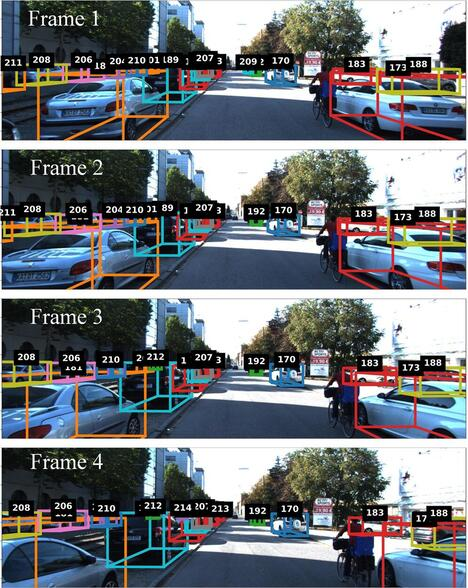

# FANTrack: 3D Multi-Object Tracking with Feature Association Network
========================================================================
<div align="center">

</div>

## Requirements
========================================================================

1. GPU that supports CUDA.
2. tensorflow-gpu 1.13
3. CUDA 10.0
4. cuDNN v7.6.5 for CUDA 10.0
5. scipy
6. numpy
7. opencv-python
8. matplotlib
9. scikit-learn
10. filterpy
11. tqdm

## Setup
---

Implemented and tested with Ubuntu 16.04, Tensorflow 1.13, and Python 3.5.

1. **Clone this repo.**

    Use one of the following two options:

    SSH:
    ```bash
    $ git clone  ist-git@git.uwaterloo.ca:wise-lab/fantrack.git --recurse-submodules
    ```

    HTTPS:
    ```bash
    $ git clone https://git.uwaterloo.ca/wise-lab/fantrack.git --recurse-submodules
    ```

2. **Init submodules**

    ```bash
    $ git submodule update --init --recursive
    ```

    FANTracker uses [AVOD](https://github.com/kujason/avod) for it's feature extractor. The AVOD submodule is located in <REPO_ROOT>/fan_tracker/object_detector`

3. **Environment Setup:**

    Add the following paths to PYTHON_PATH :

    1. Path to the root directory of the repo. <REPO_ROOT>
    2. <REPO_ROOT>/fan_track/object_detector
    3. <REPO_ROOT>/object_detector/wavedata


    It is reccommended to use a virtual environment like conda or virtualenv.
    If using virtualenv, run:
    ```bash
    $ add2virtualenv <REPO_ROOT>
    $ add2virtualenv <REPO_ROOT>/fan_track/object_detector
    $ add2virtualenv <REPO_ROOT>/fan_track/object_detector/wavedata
    ```

    Download and install [CUDA](https://developer.nvidia.com/cuda-10.0-download-archive), [cuDNN](https://developer.nvidia.com/cudnn), and [TensorFlow 1.13](https://www.tensorflow.org/install/gpu)
    Install AVOD python requirements using:
    ```bash
    $ pip3 install -r requirements.txt
    ```

4. **Setup AVOD:**

    Compile integral image library in wavedata
    ```bash
    $ cd fan_track/object_detector/
    $ sh scripts/install/build_integral_image_lib.bash
    ```

    AVOD uses Protobufs to configure model and training parameters. Before the framework can be used, the protos must be compiled (from top level AVOD folder located at `fan_track/object_detector/`):
    ```bash
    $ sh avod/protos/run_protoc.sh
    ```

    Refer  [to the AVOD github repository](https://github.com/kujason/avod) for more detailed instructions and troubleshooting for setting up AVOD.

    Temporarily, you also need to modify one of the AVOD source files in setup. This requirement will be removed in a future fix
    Make the below modification to `fantrack-standalone/fan_track/object_detector/avod/core/models/avod_model.py` line 554

    ```diff
    <     def create_feed_dict(self):
    <         feed_dict = self._rpn_model.create_feed_dict()
    ---
    >     def create_feed_dict(self, sample_index=None):
    >         feed_dict = self._rpn_model.create_feed_dict(sample_index)
    ```
5. **KITTI dataset:**

    Download the KITTI tracking dataset and place it in your home folder at `~/Kitti/tracking_dataset`.

    The dataset should be organized as follows

    ```
    tracking_dataset
        calib
            training
            testing
        image_2
            training
            testing
        labels
            label_02
        oxts
            training
            testing
        velodyne
            training
            testing
    ```

    Create empty working folders inside `~/Kitti` as follows:

    ```
    Kitti
        object
            testing
                calib
                image_2
                label_2
                velodyne
    ```

    Download the `planes` folder from the [AVOD training material here](https://drive.google.com/drive/folders/1yjCwlSOfAZoPNNqoMtWfEjPCfhRfJB-Z) and place it indo `~/Kitti/object/training`
    Your folder structure should look as follows.

    ```
    Kitti
        object
            testing
                calib
                image_2
                label_2
                velodyne
                planes
    ```

## Training
---
1. **AVOD**

    FANTrack requires trained weights for AVOD. You can find our pre-trained weights [avod_cars_fast.zip](wiselab.uwaterloo.ca/avod/avod_cars_fast.zip) (138 Mb) and [avod_people_fast.zip](wiselab.uwaterloo.ca/avod/avod_people_fast.zip) (163 Mb). Unzip this folder into `fan_track/object_detector/avod`.

    It should produce a folder  `fan_track/object_detector/avod/data`

    Alternatively, you can train AVOD yourself using the [AVOD instructions](https://github.com/kujason/avod).

3. **SimNet**

    Train simnet by running:
    ```bash
    $ python3 fan_track/experiments/train_simnet.py
    ```

    Checkpoints and data will be saved to `fan_track/data/simnet`

4. **AssocNet**

    Train assocnet by running:
    ```bash
    $ python3 fan_track/experiments/train_simnet.py
    ```

    Checkpoints and data will be saved to `fan_track/data/assocnet`

You can modify SimNet and AssocNet hyperparameters in `fan_track/config/config.py`

## Evaluation
---

TODO

## Inference
---

Run Inference using:
```bash
$ python3 fan_track/experiments/run_tracker.py
```

To change which SimNet/AssocNet checkpoint the script uses, modify the `SIMNET_CKPT_PATH` and  `ASSOCNET_CKPT_PATH` in `fan_track/config/config.py`

```py
SIMNET_CKPT_PATH = os.path.join(get_project_root(), 'fan_track/data/simnet/checkpoints/simnet.ckpt-499')
ASSOCNET_CKPT_PATH = os.path.join(get_project_root(), 'fan_track/data/simnet/checkpoints/assocnet.ckpt-999')
```

Resulting camera frames will be saved to `fan_track/data`

## Common Issues
---

```bash
ImportError: cannot import name 'softmax'
```
Solution: Update dependency `scikit-learn`.

```bash
AttributeError: 'module' object has no attribute 'TABLEAU_COLORS'
```
Solution: Update Matplotlib

```bash
ImportError: /opt/ros/kinetic/lib/python2.7/dist-packages/cv2.so: import cv2 undefined symbol PyCObject_type
```
Solution: having ROS in your PYTHONPATH breaks OpenCV. If you're using Virutalenv, you can safely clear your python path: `$ export PYTHONPATH=""`. Otherwise, see the answers here: https://stackoverflow.com/questions/43019951/after-install-ros-kinetic-cannot-import-opencv
